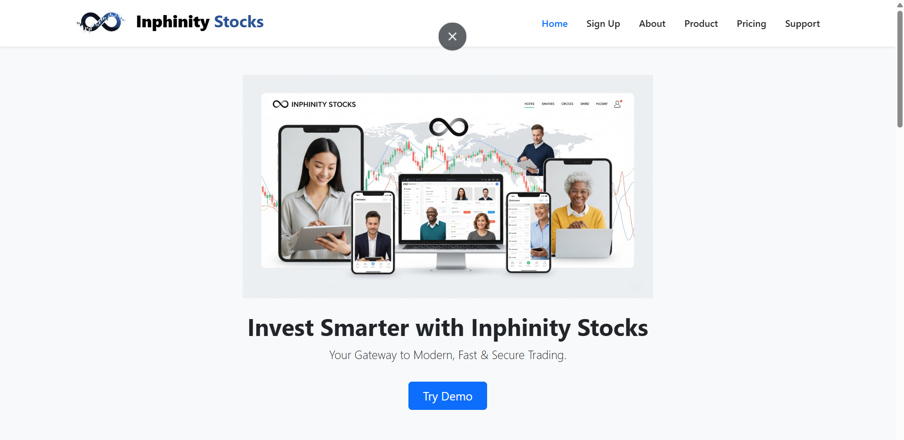

# Inphinity Stocks: Full Stack Stock Trading Web App with ML Powered Analytics

**Inphinity Stocks** is a comprehensive stock trading simulation platform built using the **MERN Stack (MongoDB, Express.js, React.js, Node.js)** with integrated **Machine Learning recommendations**. It enables users to view real-time stock updates, manage a virtual portfolio, and receive AI powered BUY/HOLD/SELL recommendations based on fundamental analysis.

> Built with a vision to replicate a professional stock trading experience with custom UI, real time data visualization, and ML driven insights for smarter investment decisions.

---

## 📸 Screenshots



---

## 🌐 Live Demo

🔗 [Try Inphinity Stocks Live](https://inphinity-stocks-frontend.onrender.com/)  

---

## 🛠️ Tech Stack

### Frontend
- **React.js** - Interactive UI components
- **Chart.js** - Real time data visualization
- **Material UI** - Professional design system
- **Axios** - API communication
- **CSS Modules** - Scoped styling

### Dashboard
- **React.js** - Dynamic trading dashboard
- **Doughnut Charts** - Portfolio allocation visualization
- **Responsive Design** - Mobile first approach

### Backend
- **Node.js** - Server side runtime
- **Express.js** - RESTful API framework
- **MongoDB Atlas** - Cloud database
- **SSE (Server-Sent Events)** - Real time data updates

### Machine Learning
- **Python 3.x** - ML model development
- **Random Forest Classifier** - Stock recommendation engine
- **scikit-learn** - ML algorithms
- **pandas** - Data processing
- **Google Colab** - Model training environment

---

## ✨ Key Features

### Trading Features
- 📈 **Real-time stock data updates** with live price tracking
- 💼 **Portfolio Management** - Track holdings, positions, and orders
- 💰 **Funds Management** - Monitor available margin and used funds
- 📊 **Interactive Charts** - Visualize portfolio allocation and stock performance
- 🔄 **Buy/Sell Orders** - Execute trades with instant updates

### ML-Powered Analytics 
- **AI Recommendations** - Machine Learning-based BUY/HOLD/SELL signals
- **Confidence Scores** - Probability breakdown for each recommendation
- **Fundamental Analysis** - Based on PE Ratio, EPS, ROE, and Debt-to-Equity
- **Model Accuracy** - 63.89% prediction accuracy on historical data
- **Beautiful Modal UI** - Professional, responsive recommendation display

### Technical Features
- 🔐 **User-friendly dashboard** with intuitive navigation
- 🎨 **Modern UI/UX** with smooth animations
- 🧠 **Modular codebase** with reusable components
- ⚡ **Fast performance** with optimized rendering
- 📱 **Fully responsive** - Works on desktop, tablet, and mobile

---

## 🧾 Project Structure

inphinity-stocks/ <br>
├── frontend <br>
├── dashboard <br>
├── backen <br>
├── ML_Model # Machine Learning pipeline (Google Colab) <br>
│ └── stock_recommendation_model.ipynb <br>
└── README.md


---

## Machine Learning Model

### Algorithm
**Random Forest Classifier** with 100 decision trees trained on 180 historical stock data points.

### Features Used
- **PE Ratio** (Price-to-Earnings)
- **EPS** (Earnings Per Share)
- **ROE** (Return on Equity)
- **Debt-to-Equity Ratio**

### Labeling Strategy
**Forward-looking labeling** based on actual 3-month future returns:
- **BUY**: Future return > +5%
- **HOLD**: Future return between -5% to +5%
- **SELL**: Future return < -5%

### Model Performance
- **Training Accuracy**: 66.67%
- **Test Accuracy**: 63.89%
- **Classes**: BUY, HOLD, SELL (3-class classification)

### Why This Accuracy?
Stock prediction is inherently uncertain due to external factors (news, sentiment, macroeconomics). Our 64% accuracy represents **91% improvement over random guessing** (33.33% baseline) and aligns with academic research benchmarks for fundamental analysis-based models (60-75%).

---

## 🧪 Local Development Setup
```
npm install <br>
npm start
```


## 💬Author


Author: Priyanshu Chaudhary <br>
📧 Email: [priyanshukaushal14@gmail.com](mailto:priyanshukaushal14@gmail.com) <br>
🌐 LinkedIn: [https://www.linkedin.com/in/priyanshu-chaudhary-1b7593255/](https://www.linkedin.com/in/priyanshu-chaudhary-1b7593255/) <br>
Happy Investing! ✨